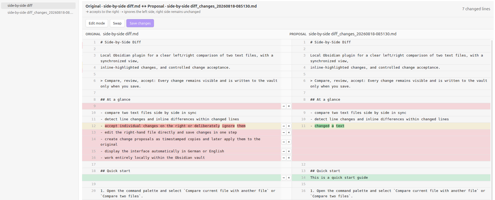
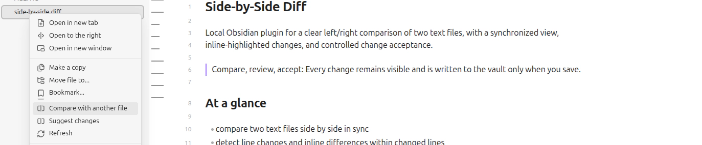

# Side-by-Side Diff

Compare two text files in a side-by-side file diff viewer. Review line changes with inline highlighting and
selectively accept or reject edits; changes are written only when explicitly saved.

> Compare, review, accept: Every change remains visible and is written to the vault only when you save.



## Contents

- [At a glance](#at-a-glance)
- [Quick start](#quick-start)
- [Three workflows](#three-workflows)
- [Edit and save](#edit-and-save)
- [Installation](#installation)
- [Privacy and permissions](#privacy-and-permissions)
- [Releases](#releases)
- [Development](#development)
- [Documentation](#documentation)
- [Tests](#tests)

## At a glance

- compare two text files side by side in sync
- detect line changes and inline differences within changed lines
- navigate between changes with `Next change` / `Previous change`, `Alt+ArrowDown` / `Alt+ArrowUp`, and automatic scrolling
- automatically continue with the next open change after accepting or ignoring one (configurable, enabled by default)
- accept individual changes on the right or deliberately ignore them
- remember the last five right-hand files and show them first in the right-file selector
- edit the right-hand file directly and save changes in one step
- create change proposals as timestamped copies and later apply them to the original
- display the interface automatically in German or English
- work entirely locally within the Obsidian vault

## Quick start

The comparison icon in the left ribbon and `Compare with another file` in the active document's menu lead to the
same view as the command palette:



1. Open the command palette and select `Compare current file with another file` or `Compare two files`.
2. Select the second file if it has not been chosen yet.
3. Review the synchronized view. Use `→` to stage a change as a proposal, or `×` to ignore the left-hand diff.
4. Navigate between changes with the toolbar or `Alt+ArrowDown` / `Alt+ArrowUp`; accept or ignore the highlighted change with `Alt+ArrowRight` / `Alt+ArrowLeft`.
5. Save all staged changes with `Save changes` or `Ctrl/Cmd + S`.

## Three workflows

### Compare

The left and right files are displayed in sync. Line changes and differences within a line are highlighted. Use
`Swap` to switch the files and their direction. If changes are pending, the plugin asks whether to save or discard
them first.

### Suggest changes

`Suggest changes` creates a copy next to the active document with a suffix and timestamp, for example
`Document_changes_20260817-143000.md`. If a matching copy already exists, the latest one is opened. The original
appears on the left and the editable proposal copy on the right.

### Accept changes

`Accept changes` appears in the document menu only when a matching change copy exists. The view is reversed so that
the copy appears on the left and the original on the right. Use `→` to selectively apply reviewed proposals to the
original. After all proposals are accepted and saved, the plugin asks whether the suffix copy should be moved to the
trash; canceling keeps the copy available.

## Edit and save

In normal diff mode, use `Edit mode` to make the right-hand side editable. The left-hand file remains read-only. If
comparison changes are pending, the plugin asks whether to save or discard them before entering edit mode. Multi-line
selection, deletion, Backspace, and `Enter` for new lines are supported.

Changes are never written automatically while typing or clicking a diff action. The file is updated only after using
`Save changes` or `Ctrl/Cmd + S`. Before saving, the plugin checks for external file changes and cancels instead of
overwriting newer content. Closing a view with unsaved changes opens a confirmation dialog.

## Installation

The plugin requires Obsidian `1.6.6` or later.

For a local installation, copy the plugin folder to `.obsidian/plugins/side-by-side-diff/`, then open
**Settings → Community plugins** and enable `Side-by-Side Diff`. The release folder must contain the generated
`main.js`, `manifest.json`, `styles.css`, and `locales/` directory.

The plugin is currently marked as desktop-only because mobile support has not been tested yet.

Set the interface language under **Settings → Side-by-Side Diff → Language** to `Automatic`, `Deutsch`, or `English`.
In automatic mode, the Obsidian language is used when supported; unsupported languages fall back to English.

## Privacy and permissions

Side-by-Side Diff runs entirely inside the current Obsidian vault.

- It makes no network requests and uses no telemetry, analytics, ads, or external services.
- It does not require an account or payment.
- It enumerates vault file metadata (paths and names) to populate the file selectors and context actions.
- It reads and writes file contents only after an explicit user action, plus its own plugin settings.
- It does not access files outside the vault.

The source repository contains TypeScript; `main.js` is generated locally and attached to releases.

## Releases

Release tags must exactly match the `version` in `manifest.json` and use the `x.y.z` format. Pushing such a tag
automatically creates a GitHub release with generated notes and uploads `main.js`, `manifest.json`, and `styles.css`.
The release workflow also creates GitHub artifact attestations for these three assets.

## Documentation

- [Features and requirements](FEATURES.md) – authoritative overview of the current scope and requirements
- [Concept: Review status display](docs/concepts/review-statusanzeige.md) – concept for clearer accepted, ignored, and open change states
- [Contributing](CONTRIBUTING.md) – development workflow, tests, and change checklist

## Development

Install the local development dependencies once, then use the following commands from this directory:

```bash
npm install
npm run dev       # development bundle with inline source maps
npm run build     # strict typecheck and production bundle
npm run validate:manifest
npm run lint      # strict ESLint checks
npm test          # TypeScript unit tests
```

TypeScript source lives in `src/`; `main.js` is the generated Obsidian entry point and is ignored by Git. Rebuild it
before installing the plugin in a vault.

## Tests

The deterministic diff, synchronization rules, and translation tables are tested in TypeScript:

```bash
npm test
```

Run the command from this plugin directory. See [CONTRIBUTING.md](CONTRIBUTING.md) for additional development
guidance.
